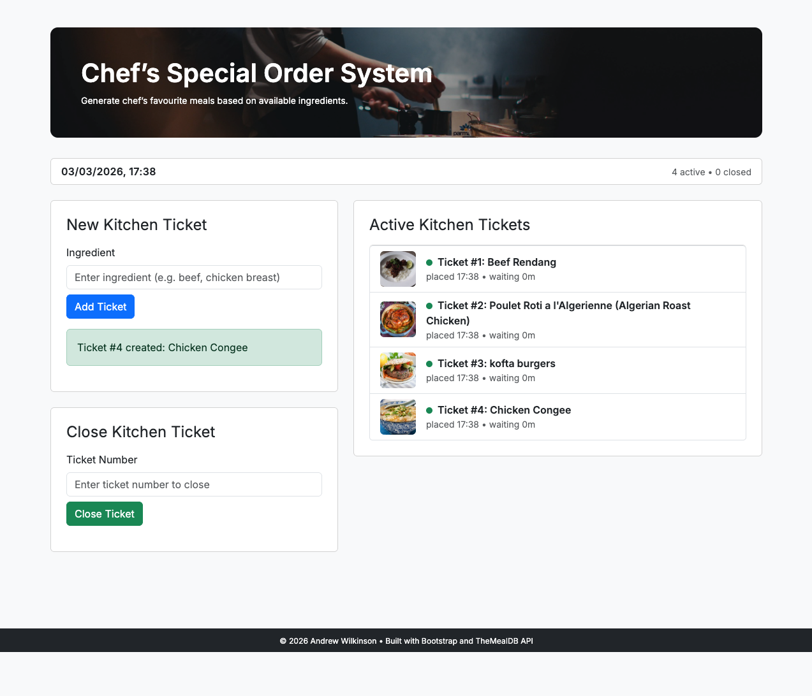

# Chef’s Special Order System

*A Quality Engineering portfolio project focused on deterministic state management and testable front-end architecture.*

---

## Live Demo

🔗 **Open the Live Application**  
https://awilkinson-qe.github.io/js-api-ticket-system/

---

## Overview

Chef’s Special Order System is a client-side web application that enables kitchen staff to generate daily specials based on available ingredients and manage active kitchen tickets in real time.

The application integrates with TheMealDB API to dynamically retrieve meal suggestions and uses `sessionStorage` for browser-scoped state management.

From a Quality Engineering perspective, the application emphasises:

- Deterministic state management
- Defensive event handling
- Separation of state and rendering logic
- Controlled API integration
- UI consistency through deterministic full re-rendering from source state

---

## Application Preview

---

## Features

- Generate chef specials using a selected ingredient  
- Fetch live meal data from TheMealDB API  
- Randomly select a meal suggestion  
- Create kitchen tickets with:
  - Unique ticket number  
  - Meal description  
  - Creation timestamp  
  - Live wait-time indicator  
  - Meal thumbnail image  
- Display only active (incomplete) tickets  
- Close tickets by ticket number  
- Persist ticket state using `sessionStorage`  
- Responsive layout using Bootstrap 5  

---

## Technologies Used

- HTML5  
- CSS3  
- Bootstrap 5  
- JavaScript (ES6+)  
- TheMealDB Public API  
- Web Storage API (`sessionStorage`)  

---

## How to Run Locally

1. Clone or download the repository.
2. Open `index.html` in your browser  
   **or**
3. Use Live Server in VS Code.

No backend setup or build tools are required.

---

## Storage Design

Ticket state is maintained using `sessionStorage`:

- `"orders"` → JSON array of ticket objects  
- `"lastOrderNumber"` → numeric ticket counter  

Data persists only while the browser tab remains open.

---

## Quality & Architectural Notes

- Defensive DOM checks prevent runtime errors.
- State is isolated from presentation logic to improve testability.
- UI rendering is derived from state rather than manually mutated.
- API responses are validated before ticket creation.
- Periodic refresh updates wait-time indicators without page reloads.
- - Session-scoped storage prevents unintended cross-session state leakage.

In a production environment, persistent storage, structured logging, and automated test coverage would be introduced.

---

## Testability Considerations

The application was designed with quality in mind:

- Clear separation between data transformation and UI rendering.
- Predictable state transitions.
- Minimal side effects within event handlers.
- Deterministic ticket number generation.
- Encapsulated storage access.

These design decisions allow the core logic to be unit tested independently from the UI layer.

---

## Future Enhancements

- Replace `sessionStorage` with persistent backend storage
- Add priority levels and SLA tracking
- Introduce filtering and search functionality
- Implement unit testing for core logic

---

## Development Notes

This project was developed as part of a personal portfolio.  
AI-assisted tools (GitHub Copilot and ChatGPT) were used for validation and refinement, with all architectural decisions and final implementation completed by the author.

---

## API Attribution

Meal data and images are provided by TheMealDB API.

---

## Image Credits

Hero background image by [Eugeniya Belova](https://unsplash.com/@evgeeeenchik) on Unsplash.